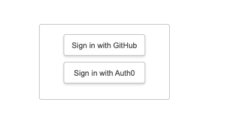

# Deploy to Azure Static Web Apps

Let's see what it takes for us to deploy this to Azure Static Web Apps, using the [recently announced support for Next.js](https://learn.microsoft.com/en-us/azure/static-web-apps/nextjs)

---

## Setup
 - Make sure you have Node.js v16 installed (next-auth does not support v18 yet)
 - Make sure you have `.env.local` setup with the relevant secrets/id for authentication provider.
 - Make sure you have the relevant ports open on local device (e.g., 3000 was used in callback-url for registering GitHub OAuth app) - if not, the callback will not work.

---

## Preview Default

 ```
// Install and use Node.js v16
$ nvm install 16
$ nvm use 16

// Install Dependencies
$ npm install

// Run Dev Server
$ npm run dev

> dev
> next

warn  - Port 3000 is in use, trying 3001 instead.
ready - started server on 0.0.0.0:3001, url: http://localhost:3001
```

Nope - we want to make sure we are using 3000. Kill server running on that port, try again.

``` 
$ npm run dev

> dev
> next

ready - started server on 0.0.0.0:3000, url: http://localhost:3000
```

Walk through the simple login process with the default UI (select GitHub button) - make sure it works!!!

---

## Clean up UI

For now lets remove all but 2 of the auth options we see on the default login UI.
  - Go to `pages/api/auth/[...nextauth].ts` and comment out all the providers (and imports) you don't use.
  - For convenience I left GitHub (configured) and Auth0 (currently not configured) to show a choice.

🔥 TODO: We can [customize the UI](https://www.youtube.com/watch?v=kB6YNYZ63fw&feature=youtu.be) later if we want to.

The new page for Auth looks like this.


---

## Deploy to Azure Static Web Apps